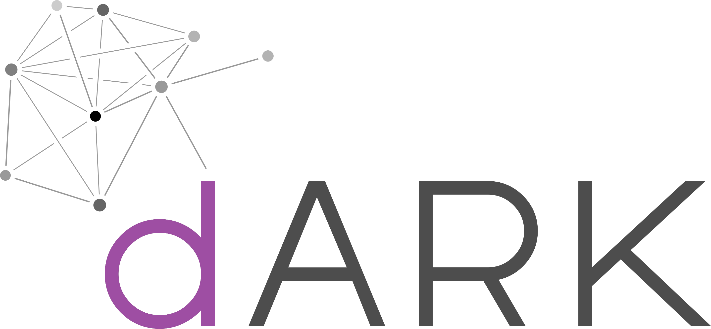

# dARK-algorithms


[](https://doi.org/10.5281/zenodo.7442743)





This repository contains a Solidity implementation of the Nice Opaque Identifiers (NOId), including the Noid Check Digit Algorithm (NCDA). This implementation enables the Archival Resource Key (ARK) minting process in decentralized environments, like Blockchain technology.

The code presented in this repository represents a small contribution to the decentralized Archival Resource Key ([dARK](https://doi.org/10.5281/zenodo.7442743)) project, which intends to leverage Blockchain technology to improve the ARK.


## Content


- 
- 

### NOID Detail

See the .

### NCDA Detail


```solidity "
    function noid_ncda(string memory id) 
    public view
    returns (string memory output) {
        
        bytes memory bid = bytes(id);


        uint256 val = 0;
        for (uint i=0; i<bid.length; i++ ){
            bytes1 _char = bid[i];
            uint prod = (i + 1) * get_char_pos(_char);
            val = val + prod;
        }

        string memory _vd = get_char_at(uint8(val % alphabet_len));
        // output = 

        return string(abi.encodePacked(id, _vd));
    }
```

For further detail see the .